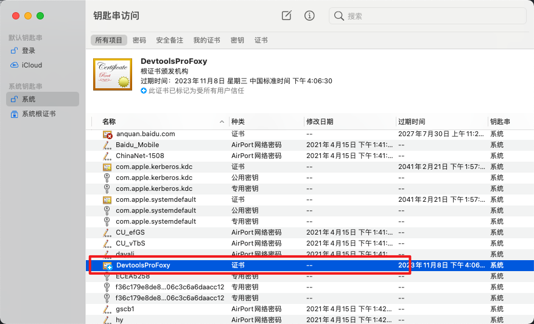

# SSL 证书安装

由于浏览器安全限制，在 https 协议页面添加 backend.js 需要使用 https，这时候需要启动 DevTools-pro 的 https server，如果启动 devtools-pro 的 https server 或者使用[Foxy 代理服务](./foxy.md)，那么你需要使用`--https`或者 config 文件中的`https`配置，这时候 DevTools-pro 会默认生成一个自认证的 CA 证书，可以通过访问`devtools.pro/ssl`下载或者 home 页面扫描对应二维码进行下载（前提是启动了 foxy 功能、并且设置对应机器的代理服务到 foxy 端口号）

CA 证书下载完毕后需要添加到信任列表中，在列表中找到**DevtoolsProFoxy**的证书，然后对应的操作可以参考 Fiddler/Charles 这类证书的安装方式。

### 证书过期

证书默认生成了两年的有效期，如果过期则执行：`devtools-pro clean-ca`命令删除对应的证书，然后重新启动 devtools-pro，按照之前操作重新下载信任即可

> 注意：
>
> 1. 在现在新版本的浏览器中，HTTPS 页面如果访问 HTTP 的资源会报[Mixed Content 错误](https://developer.mozilla.org/en-US/docs/Web/Security/Mixed_content)，所以 HTTPS 页面要进行调试需要建立 WSS 的 Websocket 连接，一般内核/Webview 可以在创建 Webview 的时候默认关闭该安全配置，用于线下包的开发调试。
> 2. iOS15+ Safari 在使用 https 的 URL，如果要链接 WSS 协议的 Websocket，需要关闭「NSURLSession WebSocket」（iOS15-默认是关闭的），路径 「iOS 设置 -> Safari -> 高级 -> Experimental Features -> NSURLSession WebSocket」 设置为关闭。详细：https://developer.apple.com/forums/thread/685403
