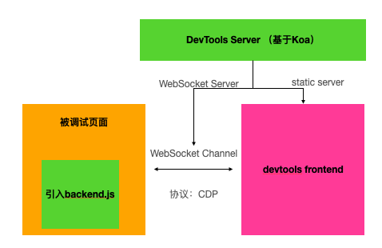
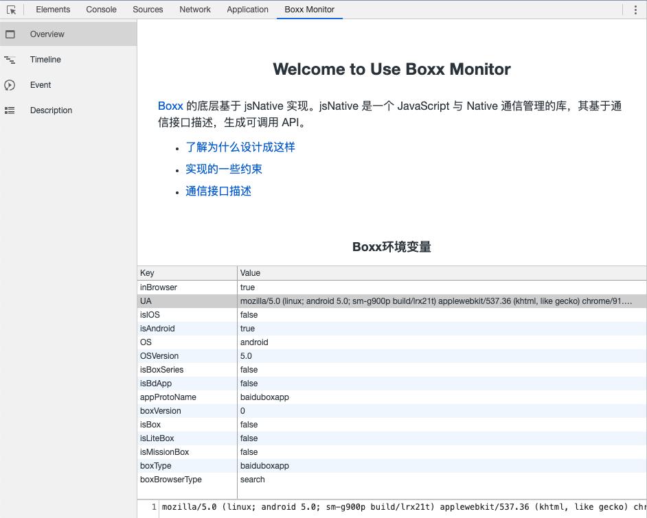
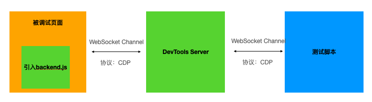

<h1 align="center">Devtools-Pro</h1>

<div align="center">
A web remote debugging tools, based on Chrome DevTools.
</div>


## 🎉 Features

-   基于 Chrome DevTools
-   基于 WebSocket 远程调试
-   可扩展，支持自定义插件

## 📦 Installation

```shell
npm i -g devtools-pro
# OR
yarn global add devtools-pro
```

## 命令行配置项

```bash
devtools-pro -h
# or
dp -h
```

```
Options:
  -h, --help      Show help                                            [boolean]
      --plugins   Add plugins                                            [array]
      --config    Provide path to a devtools configuration file e.g.
                  ./devtools.config.js     [string] [default: "devtools.config"]
  -o, --open      Open browser when server start       [boolean] [default: true]
      --https     Use HTTPS protocol.                                  [boolean]
  -p, --port      Port to use [8899]                                    [number]
      --verbose   Displays verbose logging            [boolean] [default: false]
      --hostname  Address to use [0.0.0.0]                              [string]
  -v, --version   Show version number                                  [boolean]
```

## 配置文件`devtools.config.js`

为了方便项目统一配置，DevTools-pro 支持配置文件，可以在项目中创建一个名为`devtools.config.js`的文件，支持的配置项如下：

-   logLevel：日志级别，支持`silent` `verbose`
-   port：server 端口号，默认 `8899`
-   hostname：默认 `0.0.0.0`
-   plugins：配置插件，[下面介绍](#插件开发)
-   https：server 默认是 http 的，如果要启用 https，可以设置`https=true`，或者使用此字段配置[nodejs/https 模块](https://nodejs.org/api/https.html)相关配置，例如：

```js
https:{
    key: fs.readFileSync('/path/to/server.key'),
    cert: fs.readFileSync('/path/to/server.crt'),
    ca: fs.readFileSync('/path/to/ca.pem'),
}
```

## 开发

1. clone

```bash
mkdir devtools-pro
git clone git@github.com:ksky521/devtools-pro.git devtools-pro
```

2. 安装依赖 & 初始化

```bash
yarn
# 初始化：将chrome-devtools-frontend/front_end复制出来
sh init.sh
```

3. 开始开发

```bash
yarn dev
```

访问：

-   1. 打开 home 页面：localhost:8080
-   2. 打开 demo 测试页面：点击 home 页面上测试页面链接 localhost:8080/demo.html
-   3. 打开 inspector：点击 home 页面上的【Open Chrome DevTools】

## 原理

DevTools-pro 是基于[chrome-devtools-frontend](https://github.com/ChromeDevTools/devtools-frontend)进行开发的，通过自建 WebSocket 通道实现 Frontend 和 Backend 的通信。

DevTools 主要由四部分组成：

-   Frontend：调试器前端，默认由 Chromium 内核层集成，DevTools Frontend 是一个 Web 应用程序；
-   Backend：调试器后端，Chromium、V8 或 Node.js；在这里我们主要是引入的 backend.js
-   Protocol：调试协议，调试器前端和后端使用此协议通信。 它分为代表被检查实体的语义方面的域。 每个域定义类型、命令（从前端发送到后端的消息）和事件（从后端发送到前端的消息）。该协议基于 json rpc 2.0 运行；
-   Message Channels：消息通道，消息通道是在后端和前端之间发送协议消息的一种方式。包括：Embedder Channel、WebSocket Channel、Chrome Extensions Channel、USB/ADB Channel。

这四部分的交互逻辑如下图所示：



简单来说：被调试页面引入 Backend 后，会跟 Frontend 建立连接；在 backend 中，对于一些 JavaScript API 或者 DOM 操作等进行了监听和 mock，从而页面执行对应操作时，会发送消息到 Frontend。同时 Backend 也会监听来自于 Frontend 的消息，收到消息后进行对应处理。

## 插件开发

DevTools-pro 是可以通过插件增加功能的，比如：

-   增加 devtools 面板，例如集成 san-devtools、vue-devtools、react-devtools 等到 devtools-pro 中
-   主动在页面触发 [Chrome DevTools Protocol（CDP）](https://chromedevtools.github.io/devtools-protocol/)，接收/发送数据，例如将一些特殊的请求或者信息通过 CDP 发送到 devtools frontend 中展示
-   其他脑洞大开的想法

插件可以发布一个 NPM 包，然后在项目下的`devtools.config.js`中通过`plugins`进行添加，一个 plugins 是一个 NPM 包，由以下三部分组成：

-   frontend：调试器前端，即 Chrome DevTools 的 module，按照 Chrome-Devtools-Frontend 写法进行定义，也可以使用 iframe 进行嵌入
-   backend：调试器后端，即被调试页面的引入的 js 实现
-   middleware：即 Koa 的中间件，用于增强 server 实现

这三部分根据自己插件的实际功能进行开发，并非都包含。三部分的定义是在 NPM 包的`package.json`中`devtools`字段，类似：

```json5
{
    name: 'js-native-monitor',
    version: '1.0.0',
    main: 'index.js',
    // ....
    devtools: {
        // frontend
        frontend: {
            name: 'jsna_monitor',
            type: '', // remote/autostart
            dir: 'frontend'
        },
        // backend字段，该文件内容会被merge到backend.js中
        backend: 'index.js',
        // middleware
        middleware: 'middleware.js'
    }
}
```

### Frontend

Frontend 是完全符合的[chrome-devtools-frontend](https://github.com/ChromeDevTools/devtools-frontend/tree/master/front_end/panels)的模块，`package.json`中的`devtools.frontend`包含配置有：

-   name：名字，访问`hostname:port/devtools/${name}/**` 则自动转发到这里，优先级高于内置和 chrome-devtools-frontend/front_end 文件，**如果 name 是 chrome-devtools-frontend/front_end 已经存在的则优先级高于 chrome-devtools-frontend**；
-   type：可选值：`autostart`和`remote`，含义参考 Chrome DevTools 具体实现；
-   dir：指定文件夹目录

dir 文件夹中的重要文件是模块描述文件`module.json`，通过文件夹下的 `module.json` 配置文件进行定义，配置文件有以下几个属性：

-   `scripts`：模块中包含的 JavaScript 文件数组，这里的路径名称是相对于 module.json 的位置；
-   `skip_compilation`：类似于脚本，但是 Closure Compiler 不会对这些文件进行类型检查；
-   `resources`：模块使用的非 JavaScript 文件数组；
-   `dependencies`：模块使用的其他模块的数组；
-   `extensions`：具有 type 属性的对象数组。 扩展可以通过运行时系统查询，并可以通过任何模块中的代码进行访问。类型包括 "setting"、"view"，"context-menu-item"。例如可以按如下方式注册出现在设置屏幕中的设置：

```json5
{
  "extensions": [
    {
      "type": "setting",
      "settingName": "interdimensionalWarpEnabled",
      "settingType": "boolean",
      "defaultValue": false,
      "storageType": "session",
      "title": "Show web pages from other dimensions"
    },
    ...
  ]
}
```

DevTools Frontend 通过 Module 和 Extension 机制为 Application 增加了“插件化”的能力，然后通过配置进行灵活的组装。

#### 应用举例

我们应用做多的可能是添加一个面板，例如我要添加一个`js-native`的面板，则`module.json`内容如下：

```json5
{
    extensions: [
        {
            // 类型
            type: 'view',
            // 位置
            location: 'panel',
            id: 'jsna_monitor',
            // 面板显示文字
            title: 'jsNative monitor',
            order: 110,
            // 启动className
            className: 'JSNAMonitor.JSNAMonitor'
        }
    ],
    // 依赖
    dependencies: ['platform', 'ui', 'host', 'components', 'data_grid', 'source_frame', 'sdk'],
    scripts: [],
    // 资源
    modules: ['jsna_monitor.js', 'jsna_monitor-legacy.js', 'JSNAMonitor.js'],
    resources: ['jsna.css']
}
```

此部分可以参考[@ksky521/js-native-monitor](https://github.com/ksky521/js-native-monitor)实现。

下面是我们自己实现的端能力调试面板：



### Backend

当被调试的页面引入`hostname:port/backend.js`时，backend 的文件会被合并到`backend.js`中输出。这里提供了全局命名空间`$devtools`，它的定义在[./src/runtime.js](./src/runtime.js)中。后面[通信](#通信)部分会详细介绍

### 通信

在原来的 CDP 基础上，为了方便开发插件开发，DevTools-pro 提供了两种 Backend 和 Frontend 插件的通信方式：**CDP 事件**和**自建 WebSocket**。

#### CDP 事件

在 Backend 中，提供了一个全局命名空间`$devtools`，可以通过下面方法进行事件注册。

```js
// backend中代码
$devtools.registerEvent('PluginName.method', data => {
    const result = '处理完的返回数据';
    console.log(data);
    //...
    return result;
});
// frontend插件中，发送命令给backend
runtime.getBridge().then(bridge => {
    bridge.sendCommand('PluginName.method', {}).then(a => console.log(111, a));
});
// 输出：111，处理完的返回数据
// -> frontend发送数据之后，会得到一个Promise，得到的数据是backend的事件处理函数直接返回的数据。
```

**注意**：推荐事件命名上采用跟 CDP 一致的方式，即以`.`间隔，以此来防止命名冲突，造成事件相互覆盖。

#### 自建 WebSocket

DevTools-pro 本身自带 WebSocket 服务，所以可以在 Backend 中使用`$devtools.createWebsocketConnection(wsUrl)`创建一个 WebSocket 链接：

```js
// backend代码
const channelId = $devtools.nanoid();
// -> 这里注意路径必须是/backend/开头
const wsUrl = $devtools.createWebsocketUrl(`/backend/${channelId}`);
const ws = $devtools.createWebsocketConnection(wsUrl);
ws.on('message', event => {
    // message
});
// 发送数据
ws.send('hi~');
// ws链接建立成功
ws.on('open', onOpen);
```

在 Frontend 插件中，需要利用 ChannelId 建立一条相同的 MessageChannel，这时候应该通过 CDP 事件将 channelId 由 Backend，发送的 Frontend：

```js
// backend
$devtools.sendCommand('PluginName.channelId', channelId);
```

然后在 Frontend 插件中：

```js
runtime.getBridge().then(bridge => {
    bridge.registerEvent('PluginName.channelId', channelId => {
        const wsUrl = `/frontend/${channelId}`;
        const ws = new WebSocket(wsUrl);
        ws.onmessage = event => {
            console.log(event.data);
        };
        ws.send('i am ready');
    });
});
```

具体的应用案例可以在[@baidu/san-devtools](https://github.com/baidu/san-devtools/tree/master/packages/devtools-pro)中找到。

### Middleware

middleware 的定义是在[server/Server.js](./server/Server.js#L50)，接受 3 个参数`middleware(router, logger, serverInstance)`：

-   `router`是[koa-router](https://www.npmjs.com/package/koa-router)的实例；
-   `logger`是[consola](https://www.npmjs.com/package/consola)对象，有`logger.log`、`logger.info`、`logger.debug`等方法；
-   `serverInstance`是 Server 类实例

#### 应用举例

给 server 添加 router：

```js
// middleware.js
module.exports = router => {
    router.get('/hi', ctx => {
        ctx.body = 'world';
    });
};
```

## 其他脑洞

### 自动化测试

我们可以启动 DevTools-pro 之后，通过[chrome-remote-interface](https://github.com/cyrus-and/chrome-remote-interface)链接 WebSocket，然后通过发送 CDP 命令，进行自动化测试。



```js
const CDP = require('chrome-remote-interface');

CDP(
    {
        target: 'ws://localhost:8899/frontend/TDBmn-IDKkaIV98iW20Qh'
    },
    async client => {
        const {Page, Runtime} = client;
        await Page.enable();
        const result = Runtime.evaluate({expression: 'window.location.toString()'});
        console.log(result);
    }
);
```

### Vue-DevTools、San-DevTools 等集成

我们可以在 frontend 的 module 中，添加一个 iframe 面板：

```js
export class SanDevtoolsPanel extends UI.VBox {
    constructor() {
        super('san_devtools');
        this.registerRequiredCSS('san_devtools/san_devtools.css', {enableLegacyPatching: false});
        this.contentElement.classList.add('html', 'san-devtools');
    }
    wasShown() {
        this._createIFrame();
    }
    willHide() {
        this.contentElement.removeChildren();
    }
    _createIFrame() {
        this.contentElement.removeChildren();
        const iframe = document.createElement('iframe');
        iframe.className = 'san-devtools-frame';
        iframe.setAttribute('src', '/san-devtools.html');
        iframe.tabIndex = -1;
        UI.ARIAUtils.markAsPresentation(iframe);
        this.contentElement.appendChild(iframe);
    }
}
```

然后在 Frontend 嵌入的页面中，可以直接建立自己的 WebSocket 链接直接跟 Backend 进行通信。

## 开发插件相关资料

-   [深入理解 Chrome DevTools](https://zhaomenghuan.js.org/blog/chrome-devtools.html)
-   [Chrome DevTools Frontend 运行原理浅析](https://zhaomenghuan.js.org/blog/chrome-devtools-frontend-analysis-of-principle.html)
